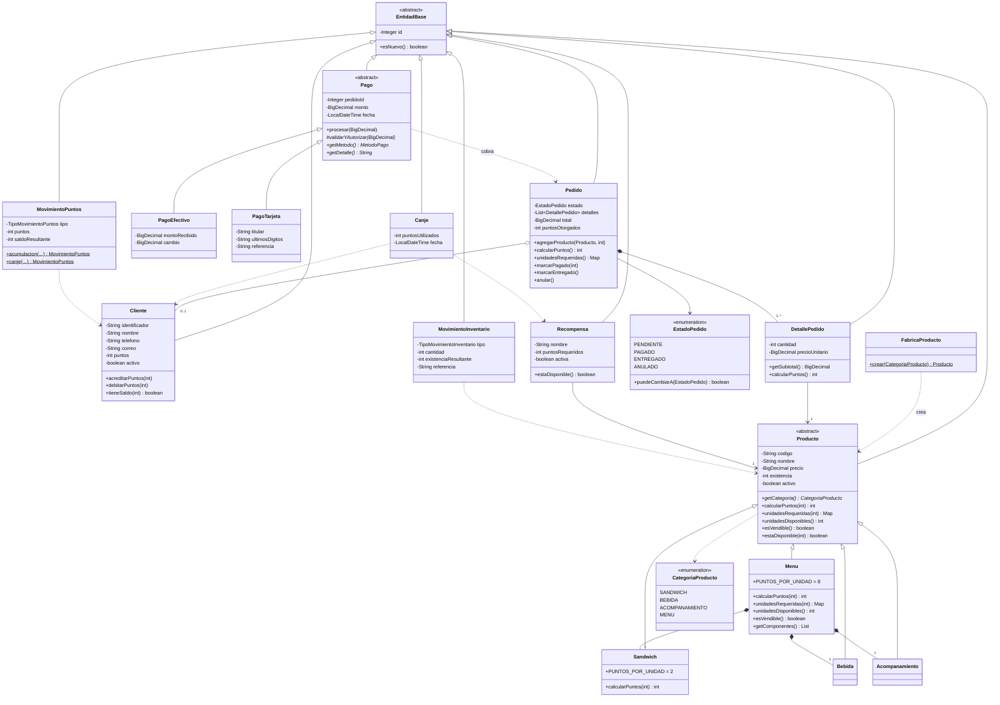
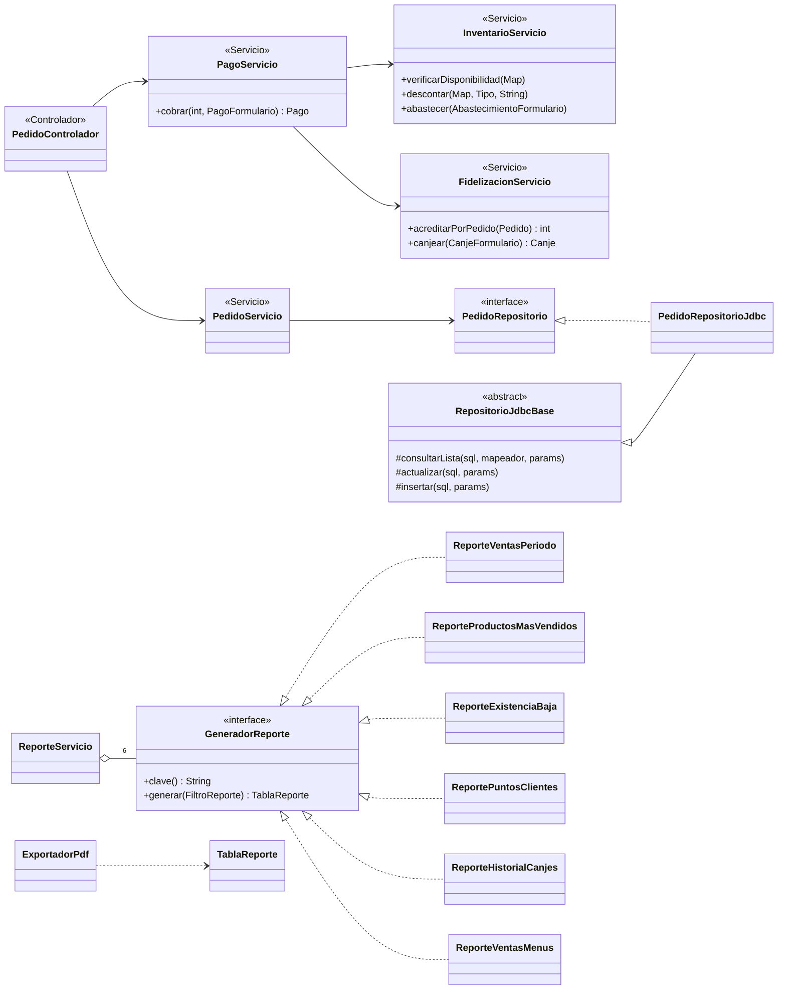

# Diagrama de clases UML

## Modelo de dominio

```mermaid
classDiagram
    direction TB

    class EntidadBase {
        <<abstract>>
        -Integer id
        +esNuevo() boolean
    }

    class Cliente {
        -String identificador
        -String nombre
        -String telefono
        -String correo
        -int puntos
        -boolean activo
        +acreditarPuntos(int)
        +debitarPuntos(int)
        +tieneSaldo(int) boolean
    }

    class Producto {
        <<abstract>>
        -String codigo
        -String nombre
        -BigDecimal precio
        -int existencia
        -boolean activo
        +getCategoria()* CategoriaProducto
        +calcularPuntos(int) int
        +unidadesRequeridas(int) Map
        +unidadesDisponibles() int
        +esVendible() boolean
        +estaDisponible(int) boolean
    }

    class Sandwich {
        +PUNTOS_POR_UNIDAD = 2
        +calcularPuntos(int) int
    }
    class Bebida
    class Acompanamiento
    class Menu {
        +PUNTOS_POR_UNIDAD = 8
        +calcularPuntos(int) int
        +unidadesRequeridas(int) Map
        +unidadesDisponibles() int
        +esVendible() boolean
        +getComponentes() List
    }

    class CategoriaProducto {
        <<enumeration>>
        SANDWICH
        BEBIDA
        ACOMPANAMIENTO
        MENU
    }

    class FabricaProducto {
        +crear(CategoriaProducto)$ Producto
    }

    class Pedido {
        -EstadoPedido estado
        -List~DetallePedido~ detalles
        -BigDecimal total
        -int puntosOtorgados
        +agregarProducto(Producto, int)
        +calcularPuntos() int
        +unidadesRequeridas() Map
        +marcarPagado(int)
        +marcarEntregado()
        +anular()
    }

    class DetallePedido {
        -int cantidad
        -BigDecimal precioUnitario
        +getSubtotal() BigDecimal
        +calcularPuntos() int
    }

    class EstadoPedido {
        <<enumeration>>
        PENDIENTE
        PAGADO
        ENTREGADO
        ANULADO
        +puedeCambiarA(EstadoPedido) boolean
    }

    class Pago {
        <<abstract>>
        -Integer pedidoId
        -BigDecimal monto
        -LocalDateTime fecha
        +procesar(BigDecimal)
        #validarYAutorizar(BigDecimal)*
        +getMetodo()* MetodoPago
        +getDetalle()* String
    }

    class PagoEfectivo {
        -BigDecimal montoRecibido
        -BigDecimal cambio
    }

    class PagoTarjeta {
        -String titular
        -String ultimosDigitos
        -String referencia
    }

    class Recompensa {
        -String nombre
        -int puntosRequeridos
        -boolean activa
        +estaDisponible() boolean
    }

    class Canje {
        -int puntosUtilizados
        -LocalDateTime fecha
    }

    class MovimientoPuntos {
        -TipoMovimientoPuntos tipo
        -int puntos
        -int saldoResultante
        +acumulacion(...)$ MovimientoPuntos
        +canje(...)$ MovimientoPuntos
    }

    class MovimientoInventario {
        -TipoMovimientoInventario tipo
        -int cantidad
        -int existenciaResultante
        -String referencia
    }

    EntidadBase <|-- Cliente
    EntidadBase <|-- Producto
    EntidadBase <|-- Pedido
    EntidadBase <|-- DetallePedido
    EntidadBase <|-- Pago
    EntidadBase <|-- Recompensa
    EntidadBase <|-- Canje
    EntidadBase <|-- MovimientoPuntos
    EntidadBase <|-- MovimientoInventario

    Producto <|-- Sandwich
    Producto <|-- Bebida
    Producto <|-- Acompanamiento
    Producto <|-- Menu
    Producto ..> CategoriaProducto
    FabricaProducto ..> Producto : crea

    Menu *-- "1" Sandwich
    Menu *-- "1" Bebida
    Menu *-- "1" Acompanamiento

    Pedido *-- "1..*" DetallePedido
    Pedido o-- "0..1" Cliente
    Pedido --> EstadoPedido
    DetallePedido --> "1" Producto

    Pago <|-- PagoEfectivo
    Pago <|-- PagoTarjeta
    Pago ..> Pedido : cobra

    Recompensa --> "1" Producto
    Canje ..> Recompensa
    Canje ..> Cliente
    MovimientoPuntos ..> Cliente
    MovimientoInventario ..> Producto
```

## Arquitectura MVC por capas

```mermaid
classDiagram
    direction LR

    class PedidoControlador {
        <<Controlador>>
    }
    class PedidoServicio {
        <<Servicio>>
    }
    class PagoServicio {
        <<Servicio>>
        +cobrar(int, PagoFormulario) Pago
    }
    class InventarioServicio {
        <<Servicio>>
        +verificarDisponibilidad(Map)
        +descontar(Map, Tipo, String)
        +abastecer(AbastecimientoFormulario)
    }
    class FidelizacionServicio {
        <<Servicio>>
        +acreditarPorPedido(Pedido) int
        +canjear(CanjeFormulario) Canje
    }
    class PedidoRepositorio {
        <<interface>>
    }
    class PedidoRepositorioJdbc
    class RepositorioJdbcBase {
        <<abstract>>
        #consultarLista(sql, mapeador, params)
        #actualizar(sql, params)
        #insertar(sql, params)
    }
    class GeneradorReporte {
        <<interface>>
        +clave() String
        +generar(FiltroReporte) TablaReporte
    }
    class ReporteServicio
    class ExportadorPdf

    PedidoControlador --> PedidoServicio
    PedidoControlador --> PagoServicio
    PagoServicio --> InventarioServicio
    PagoServicio --> FidelizacionServicio
    PedidoServicio --> PedidoRepositorio
    PedidoRepositorio <|.. PedidoRepositorioJdbc
    RepositorioJdbcBase <|-- PedidoRepositorioJdbc
    ReporteServicio o-- "6" GeneradorReporte
    GeneradorReporte <|.. ReporteVentasPeriodo
    GeneradorReporte <|.. ReporteProductosMasVendidos
    GeneradorReporte <|.. ReporteExistenciaBaja
    GeneradorReporte <|.. ReportePuntosClientes
    GeneradorReporte <|.. ReporteHistorialCanjes
    GeneradorReporte <|.. ReporteVentasMenus
    ExportadorPdf ..> TablaReporte
```
