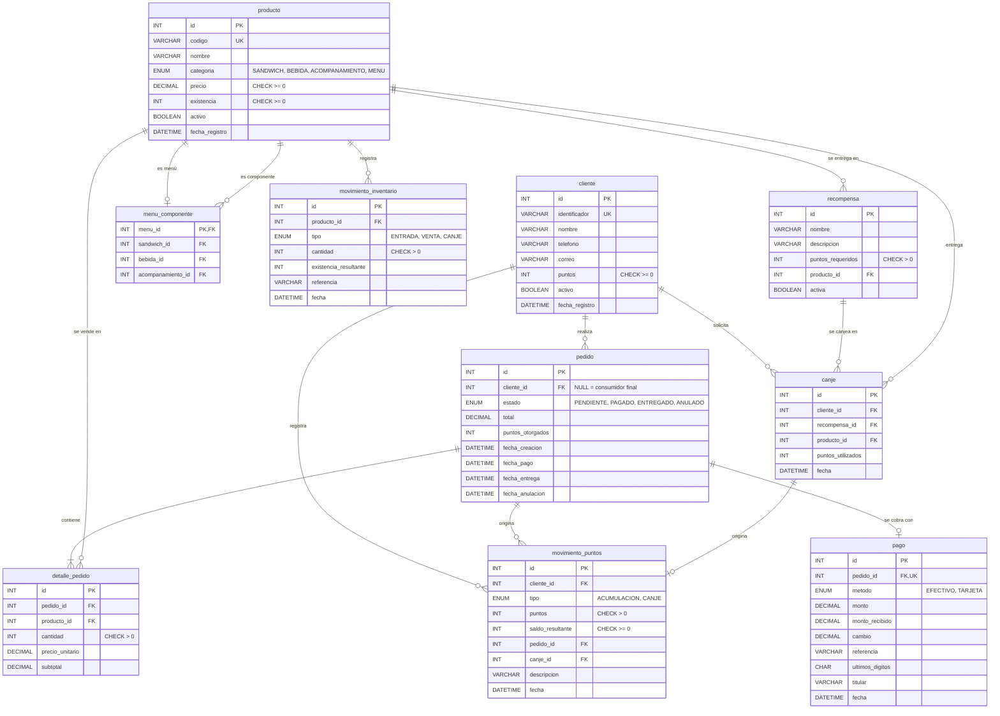

# Diagrama entidad-relación

Base de datos: `proyecto_final` (MySQL 8, InnoDB, utf8mb4).

```mermaid
erDiagram
    cliente {
        INT id PK
        VARCHAR identificador UK
        VARCHAR nombre
        VARCHAR telefono
        VARCHAR correo
        INT puntos "CHECK >= 0"
        BOOLEAN activo
        DATETIME fecha_registro
    }

    producto {
        INT id PK
        VARCHAR codigo UK
        VARCHAR nombre
        ENUM categoria "SANDWICH, BEBIDA, ACOMPANAMIENTO, MENU"
        DECIMAL precio "CHECK >= 0"
        INT existencia "CHECK >= 0"
        BOOLEAN activo
        DATETIME fecha_registro
    }

    menu_componente {
        INT menu_id PK, FK
        INT sandwich_id FK
        INT bebida_id FK
        INT acompanamiento_id FK
    }

    movimiento_inventario {
        INT id PK
        INT producto_id FK
        ENUM tipo "ENTRADA, VENTA, CANJE"
        INT cantidad "CHECK > 0"
        INT existencia_resultante
        VARCHAR referencia
        DATETIME fecha
    }

    pedido {
        INT id PK
        INT cliente_id FK "NULL = consumidor final"
        ENUM estado "PENDIENTE, PAGADO, ENTREGADO, ANULADO"
        DECIMAL total
        INT puntos_otorgados
        DATETIME fecha_creacion
        DATETIME fecha_pago
        DATETIME fecha_entrega
        DATETIME fecha_anulacion
    }

    detalle_pedido {
        INT id PK
        INT pedido_id FK
        INT producto_id FK
        INT cantidad "CHECK > 0"
        DECIMAL precio_unitario
        DECIMAL subtotal
    }

    pago {
        INT id PK
        INT pedido_id FK, UK
        ENUM metodo "EFECTIVO, TARJETA"
        DECIMAL monto
        DECIMAL monto_recibido
        DECIMAL cambio
        VARCHAR referencia
        CHAR ultimos_digitos
        VARCHAR titular
        DATETIME fecha
    }

    recompensa {
        INT id PK
        VARCHAR nombre
        VARCHAR descripcion
        INT puntos_requeridos "CHECK > 0"
        INT producto_id FK
        BOOLEAN activa
    }

    canje {
        INT id PK
        INT cliente_id FK
        INT recompensa_id FK
        INT producto_id FK
        INT puntos_utilizados
        DATETIME fecha
    }

    movimiento_puntos {
        INT id PK
        INT cliente_id FK
        ENUM tipo "ACUMULACION, CANJE"
        INT puntos "CHECK > 0"
        INT saldo_resultante "CHECK >= 0"
        INT pedido_id FK
        INT canje_id FK
        VARCHAR descripcion
        DATETIME fecha
    }

    cliente ||--o{ pedido : realiza
    cliente ||--o{ canje : solicita
    cliente ||--o{ movimiento_puntos : registra
    pedido ||--|{ detalle_pedido : contiene
    producto ||--o{ detalle_pedido : "se vende en"
    pedido ||--o| pago : "se cobra con"
    producto ||--o| menu_componente : "es menú"
    producto ||--o{ menu_componente : "es componente"
    producto ||--o{ movimiento_inventario : registra
    producto ||--o{ recompensa : "se entrega en"
    recompensa ||--o{ canje : "se canjea en"
    producto ||--o{ canje : entrega
    pedido ||--o{ movimiento_puntos : origina
    canje ||--o| movimiento_puntos : origina
```
